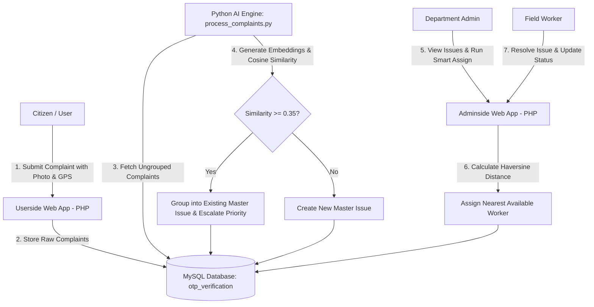

# 🏙️ CivicPulse — AI-Powered Civic Complaint Management Platform

[](https://www.php.net/)
[](https://www.python.org/)
[](https://www.mysql.com/)
[](LICENSE)

**CivicPulse** is an intelligent, full-stack civic complaint resolution system designed to connect citizens directly with local government municipal departments. It leverages **Natural Language Processing (NLP) sentence transformers** to automatically group duplicate complaints into unified master issues, dynamically calculate priority based on complaint density, and use **Haversine geospatial calculations** to assign nearest available field workers for rapid issue resolution.

---

## 🌟 Key Features

### 👤 Citizen Portal (`/userside`)
- **Secure Authentication & OTP**: Account creation, secure login, and email OTP verification integrated via **PHPMailer**.
- **Interactive Issue Submission**: Submit complaints with category selection, detailed descriptions, photo attachments, and precise interactive map pin locations powered by **Leaflet.js**.
- **Real-Time Complaint Tracking**: Track the life cycle of submitted complaints (`Open` ➔ `In Progress` ➔ `Resolved`).
- **User Profile Management**: Update personal info, credentials, and password securely.

### 🧠 AI & ML Processing Engine (`process_complaints.py`)
- **NLP Duplicate Grouping**: Pre-trained Hugging Face Transformer model (`all-MiniLM-L6-v2`) computes semantic text embeddings for complaint descriptions.
- **Cosine Similarity Clustering**: Automatically clusters semantically similar complaints submitted across different users within the same department and issue type (similarity threshold $\ge$ 0.35).
- **Dynamic Priority Scoring**: Automatically recalculates and escalates issue priority (`LOW`, `MEDIUM`, `HIGH`) based on duplicate complaint volume.
- **Geospatial Master Mapping**: Groups related individual complaints under central master "Issues" for streamlined administrative action.

### 🛡️ Administrative Portal (`/adminside`)
- **Role-Based Dashboards**: Tailored views for Central Admin and Departmental Admins (Roads, Drainage, Streetlights, Sanitation, etc.).
- **Smart Worker Assignment**: Algorithmic nearest-worker allocation using the **Haversine formula** to measure real-time distance between field workers and issue coordinates.
- **Field Worker Management**: Maintain worker rosters, contact details, department assignments, and live status toggles (`Available` / `Busy`).
- **Issue Lifecycle & Resolution**: View grouped complaint details, assign tasks, update status, and attach proof of work upon resolution.
- **Analytics & Reporting**: Visual data metrics on resolved vs pending issues per department.

---

## 🏗️ System Architecture



---

## 🛠️ Tech Stack

- **Frontend**: HTML5, CSS3, JavaScript (ES6+), Leaflet.js (OpenStreetMap API), Google Fonts (Inter, Segoe UI)
- **Backend**: PHP 7.4+, Python 3.8+
- **Database**: MySQL / MariaDB (`mysqli` & `mysql-connector-python`)
- **Machine Learning**: `sentence-transformers` (`all-MiniLM-L6-v2`), `scikit-learn`, `numpy`
- **Email Service**: PHPMailer (SMTP integration for OTP verification & notifications)
- **Web Server**: Apache / XAMPP / WAMP / Nginx

---

## 📁 Repository Structure

```text
CivicPulse/
├── index.php                 # Public Landing / About page & auth modal
├── process_complaints.py     # AI background service for semantic clustering & priority scoring
│
├── userside/                 # Citizen portal
│   ├── complaint.php         # Issue reporting form with Leaflet map & image upload
│   ├── track.php             # Real-time status tracking dashboard
│   ├── login.php             # Citizen login
│   ├── signup.php            # Registration page
│   ├── verify_otp.php        # OTP email verification
│   ├── profile.php           # User profile management
│   ├── homestyle.css         # Styling for user portal
│   └── PHPMailer/            # SMTP email module
│
├── adminside/                # Admin & Departmental portal
│   ├── dashboard.php         # Department admin dashboard
│   ├── central_admin_dashboard.php # Master administrative overview
│   ├── smart_assign.php      # Haversine nearest worker assignment algorithm
│   ├── assign_work.php       # Manual worker assignment
│   ├── update_status.php     # Issue lifecycle update tool
│   ├── workers.php           # Field worker roster management
│   ├── view_issue.php        # Detailed master issue view
│   ├── reports.php          # Analytical reports and metrics
│   ├── adminlogin.php        # Administrative login
│   └── PHPMailer/            # SMTP email module
│
└── uploads/                  # Upload directory for complaint & proof images
```

---

## ⚡ Setup & Installation Guide

### Prerequisites
- [XAMPP](https://www.apachefriends.org/) / WAMP / LAMP (PHP 7.4+ & MySQL 5.7+)
- Python 3.8+ & `pip`
- Git

---

### Step 1: Clone the Repository
```bash
git clone https://github.com/SowndharyaPL15/civicpulse.git
cd civicpulse
```

---

### Step 2: Database Setup
1. Start **Apache** and **MySQL** in XAMPP / WAMP.
2. Open phpMyAdmin (`http://localhost/phpmyadmin`).
3. Create a new database named **`otp_verification`**.
4. Import the database schema or run the following SQL script:

```sql
CREATE DATABASE IF NOT EXISTS otp_verification;
USE otp_verification;

-- Users table
CREATE TABLE IF NOT EXISTS users (
    user_id INT AUTO_INCREMENT PRIMARY KEY,
    name VARCHAR(100) NOT NULL,
    email VARCHAR(100) UNIQUE NOT NULL,
    password VARCHAR(255) NOT NULL,
    otp VARCHAR(6) DEFAULT NULL,
    is_verified TINYINT(1) DEFAULT 0,
    created_at TIMESTAMP DEFAULT CURRENT_TIMESTAMP
);

-- Admin table
CREATE TABLE IF NOT EXISTS admin (
    admin_id INT AUTO_INCREMENT PRIMARY KEY,
    username VARCHAR(50) UNIQUE NOT NULL,
    password VARCHAR(255) NOT NULL,
    dept_id INT DEFAULT NULL,
    role ENUM('Central', 'Department') DEFAULT 'Department'
);

-- Departments table
CREATE TABLE IF NOT EXISTS departments (
    dept_id INT AUTO_INCREMENT PRIMARY KEY,
    dept_name VARCHAR(100) NOT NULL
);

-- Issue types table
CREATE TABLE IF NOT EXISTS issue_types (
    type_id INT AUTO_INCREMENT PRIMARY KEY,
    issue_name VARCHAR(100) NOT NULL,
    dept_id INT NOT NULL,
    FOREIGN KEY (dept_id) REFERENCES departments(dept_id) ON DELETE CASCADE
);

-- Master Issues table (Clustered by AI)
CREATE TABLE IF NOT EXISTS issues (
    id INT AUTO_INCREMENT PRIMARY KEY,
    issue_title VARCHAR(255) NOT NULL,
    department_id INT NOT NULL,
    issue_type_id INT NOT NULL,
    complaint_count INT DEFAULT 1,
    priority ENUM('LOW', 'MEDIUM', 'HIGH') DEFAULT 'LOW',
    latitude DECIMAL(10, 8),
    longitude DECIMAL(11, 8),
    status ENUM('Open', 'In Progress', 'Resolved') DEFAULT 'Open',
    assigned_worker_id INT DEFAULT NULL,
    created_at TIMESTAMP DEFAULT CURRENT_TIMESTAMP
);

-- Individual Complaints table
CREATE TABLE IF NOT EXISTS complaints (
    cid INT AUTO_INCREMENT PRIMARY KEY,
    user_id INT NOT NULL,
    department_id INT NOT NULL,
    issue_type_id INT NOT NULL,
    description TEXT NOT NULL,
    image VARCHAR(255) DEFAULT NULL,
    latitude DECIMAL(10, 8),
    longitude DECIMAL(11, 8),
    issue_id INT DEFAULT NULL,
    created_at TIMESTAMP DEFAULT CURRENT_TIMESTAMP,
    FOREIGN KEY (user_id) REFERENCES users(user_id) ON DELETE CASCADE,
    FOREIGN KEY (issue_id) REFERENCES issues(id) ON DELETE SET NULL
);

-- Workers table
CREATE TABLE IF NOT EXISTS workers (
    worker_id INT AUTO_INCREMENT PRIMARY KEY,
    name VARCHAR(100) NOT NULL,
    phone VARCHAR(20) NOT NULL,
    department_id INT NOT NULL,
    status ENUM('Available', 'Busy') DEFAULT 'Available',
    latitude DECIMAL(10, 8) DEFAULT NULL,
    longitude DECIMAL(11, 8) DEFAULT NULL,
    FOREIGN KEY (department_id) REFERENCES departments(dept_id) ON DELETE CASCADE
);
```

---

### Step 3: Configure Database Connection
Ensure database credentials match your MySQL server settings in both PHP config files and the Python script:

- **`userside/config.php`** & **`adminside/config.php`**:
  ```php
  $conn = new mysqli("localhost", "root", "", "otp_verification");
  ```

- **`process_complaints.py`**:
  ```python
  DB_CONFIG = {
      "host": "localhost",
      "user": "root",
      "password": "",
      "database": "otp_verification"
  }
  ```

---

### Step 4: Python AI Environment Setup
Install the Python dependencies required for semantic processing:

```bash
pip install sentence-transformers scikit-learn numpy mysql-connector-python
```

---

### Step 5: Run the Application

1. Move/copy the repository folder into your web server document root (e.g., `C:\xampp\htdocs\CivicPulse`).
2. Open your browser and navigate to:
   - **Public / User Portal**: `http://localhost/CivicPulse/index.php`
   - **Admin Portal**: `http://localhost/CivicPulse/adminside/adminlogin.php`
3. Launch the AI Complaint Processor to automatically cluster complaints and compute priority scores:
   ```bash
   python process_complaints.py
   ```

---

## 📊 How Priority Escalation Works

The AI engine continuously inspects new complaints and updates master issue priority based on crowd-sourced reports:

| Complaint Count | Assigned Priority Level |
| :---: | :---: |
| **1 - 2 Reports** | 🟢 **LOW** |
| **3 - 5 Reports** | 🟡 **MEDIUM** |
| **6+ Reports** | 🔴 **HIGH** |

---

## 🤝 Contributing

Contributions are welcome! Please follow these steps:
1. Fork the Project repository.
2. Create your Feature Branch (`git checkout -b feature/AmazingFeature`).
3. Commit your changes (`git commit -m 'Add some AmazingFeature'`).
4. Push to the Branch (`git push origin feature/AmazingFeature`).
5. Open a Pull Request.

---

## 📜 License

Distributed under the MIT License. See `LICENSE` for more information.

---

